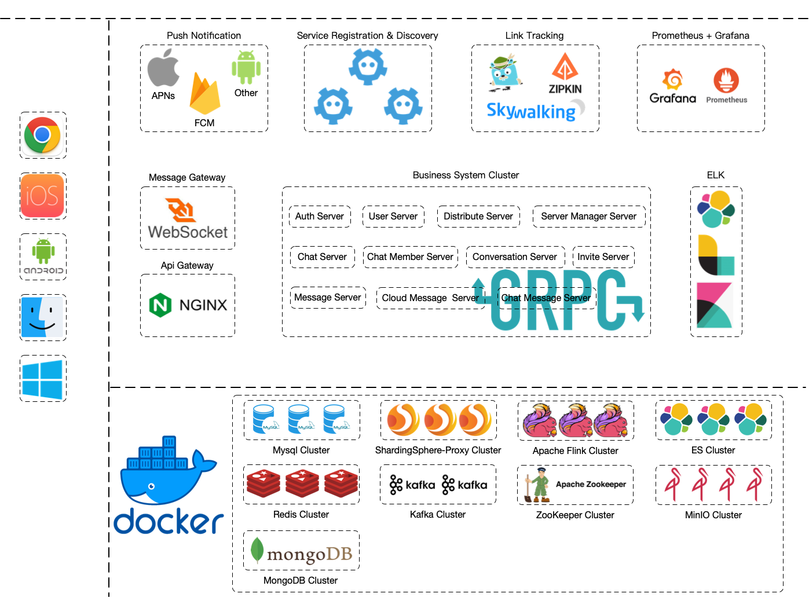

Lark是一个开源的Golang IM服务端项目，具有高性能和可扩展等特性。采用微服务架构设计，支持集群和水平扩展，能够满足高并发业务需求，并实现了万人群消息的秒达。


### 技术选型及开发环境
| 序号 | 技术                   | 版本              | 说明            | 官网                                         |
|----|----------------------|-----------------|---------------|--------------------------------------------|
| 1  | Go                   | 1.21          | 开发语言          | https://go.dev/                            |
| 2  | Lua                  | 5.3             | Redis Lua 脚本  | http://www.lua.org/                        |
| 3  | Mysql                | 8.0.29          | 关系型数据库        | https://www.mysql.com/                     |
| 4  | MongoDB              | 5.0.9           | NoSql数据库 | https://www.mongodb.com                    |
| 5  | Elasticsearch        | 7.17.6          | 搜索和分析引擎       | https://www.elastic.co/cn/elasticsearch/   |
| 6  | Redis                | 6.2.7           | KV 数据库        | https://redis.io/                          |
| 7  | Kafka                | 3.2.1           | 消息中间件         | https://kafka.apache.org/                  |
| 8  | RabbitMQ             | 3.10.0          | 消息中间件         | https://www.rabbitmq.com/                  |
| 9  | ZooKeeper            | 3.7.1           | 分布式协调服务       | https://zookeeper.apache.org/              |
| 10 | Docker               | 20.10.17        | 应用容器引擎        | https://www.docker.com                     |
| 11 | MinIO                | 2022.12.12      | 对象存储          | https://min.io/                            |
| 12 | Nginx                | 1.23.1          | Web/反向代理      | https://www.nginx.com/                     |
| 13 | JWT                  | v4.4.2          | JWT登录支持       | https://github.com/golang-jwt/jwt          |
| 14 | Validator            | v10.11.0        | 验证框架          | https://github.com/go-playground/validator |
| 15 | Jaeger               | all-in-one:1.37 | 链路追踪          | https://www.jaegertracing.io               |
| 16 | Prometheus           | 2.36.2          | 系统监控和报警系统     | https://prometheus.io/                     |
| 17 | Grafana              | 8.2.6           | 指标数据的可视化展现    | https://grafana.com/                       |
| 18 | ETCD                 | 3.5             | 服务发现          | https://etcd.io/                           |
| 19 | Kibana               | 7.17.6          | 数据分析和可视化平台    | https://www.elastic.co/cn/kibana/          |
| 20 | Logstash             | 7.17.6          | 数据收集引擎        | https://www.elastic.co/cn/logstash/        |
| 21 | Filebeat             | 7.17.6          | 日志采集器         | https://www.elastic.co/cn/beats/filebeat   |
| 22 | Flink                | 1.14.6          | 通用数据处理平台      | https://flink.apache.org/                  |
| 23 | ShardingSphere-Proxy | 5.2.1           | 数据库中间件        | https://shardingsphere.apache.org/         |
| 24 | Mycat                | 2.1.21          | 数据库中间件【已弃用】   | http://mycatone.top/                       |
| 25 | Gin                  | v1.8.1          | Web 框架        | https://github.com/gin-gonic/gin           |
| 26 | gRpc                 | v1.49.0         | 远程过程调用系统      | https://pkg.go.dev/google.golang.org/grpc  |
| 27 | GORM                 | v1.23.8         | ORM           | https://gorm.io/                           |





### 单机版运行步骤

```
Step 1
下载单机版分支代码（注:该分支代码已停止维护）
git clone -b standalone git@github.com:sevtin/lark.git

Step 2
创建日志文件目录
/var/log/lark

Step 3
创建docker容器数据卷目录
/Volumes/data/lark

Step 4
修改host文件
lark/configs/docker/host.txt

Step 5
执行容器启动脚本
./lark/build/run/docker-up.sh

Step 6
http://127.0.0.1:9001/identity/account/new-account
Minio Create Service Account
Access Key: SEv0QKlwqQ36M1eV
Secret Key: sZVZR1RD8Pcy73NANvk6vbMmoDsGSSOk

Create Buckets And Change Access Policy
["documents","photos","videos"]
Access Policy: Public

mkdir -p /private/tmp/lark/photos

upload files to photos
./lark/assets/images/avatar/06b73ea9-0c61-4ea6-b3e5-f89d89d53add.jpeg
./lark/assets/images/avatar/6b546cc7-5e4a-4d31-8017-1e5853f88a1c.jpeg
./lark/assets/images/avatar/b11883ba-f3d7-4164-a593-700c177c37c8.jpeg

update CONST_AVATAR_SMALL/CONST_AVATAR_MEDIUM/CONST_AVATAR_LARGE/SYSTEM_ACCOUNT_AVATAR_CONTACT_INVITE

Step 7
通过Apache Flink同步数据到Elasticsearch

Step 8
执行build脚本
./lark/scripts/build.sh

Step 9
执行项目启动脚本
./lark/build/run/run_all.sh

```

### 视频教程地址
https://space.bilibili.com/178350755

### 支持作者
维护这个项目需要花费大量的时间和精力来保持其更新和改进。如果你愿意支持我们，你的捐款将帮助我们继续保持项目的活跃性。
<center>


</center>

[](https://starchart.cc/sevtin/lark)

